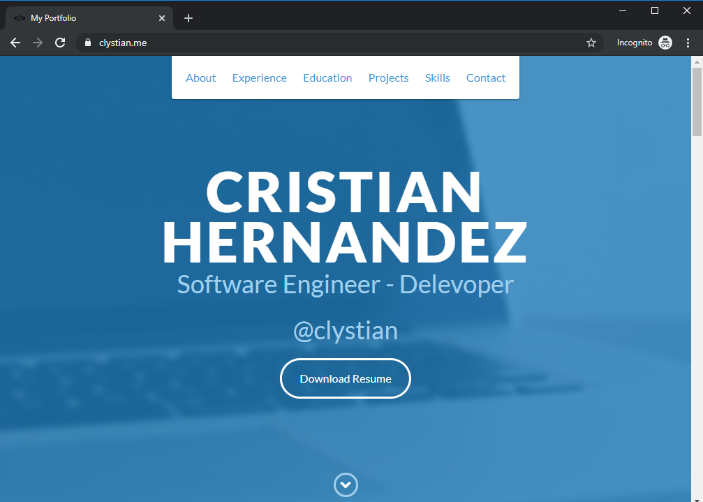
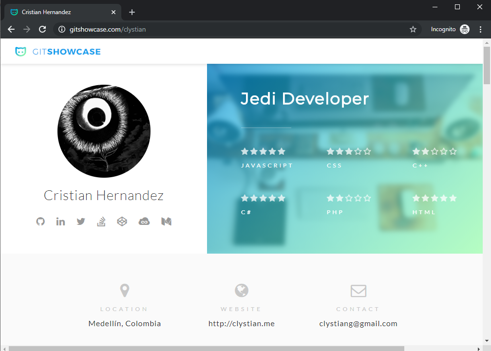

# GitHub Page clystian.github.io 

### Top Languages - GitHub


[](https://github.com/anuraghazra/github-readme-stats)

## links

https://clystian.github.io or https://clystian.ninja

# Page Preview 2020-01-04



# Screenshot from gitshowcases



This is a modern portfolio site built with [Astro](https://astro.build/) and [Tailwind CSS](https://tailwindcss.com/), deployed via GitHub Pages.

## Development

```bash
npm install
npm run dev
```

## Build for Production

```bash
npm run build
```

## Deploy to GitHub Pages

- Ensure the `CNAME` file in `public/` is set to your custom domain (if using one).
- Push the `dist/` folder to the `gh-pages` branch or configure your repository for GitHub Pages deployment.

## License

MIT
