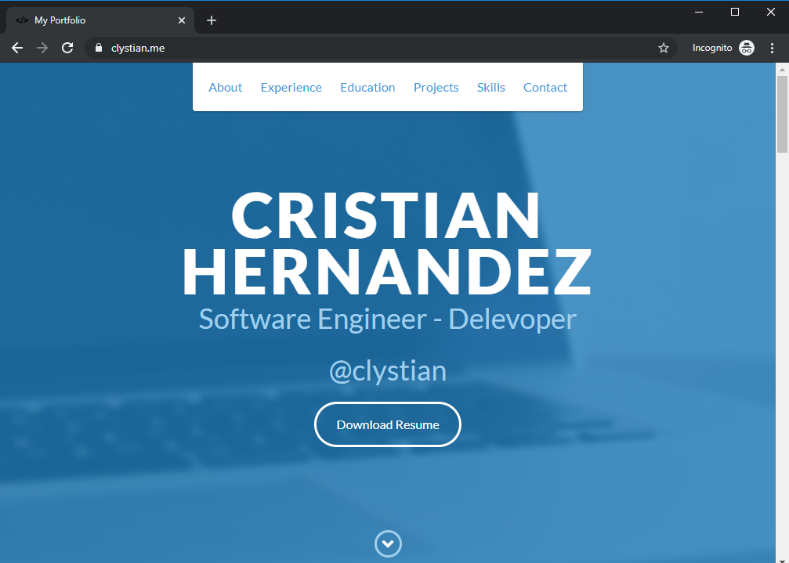
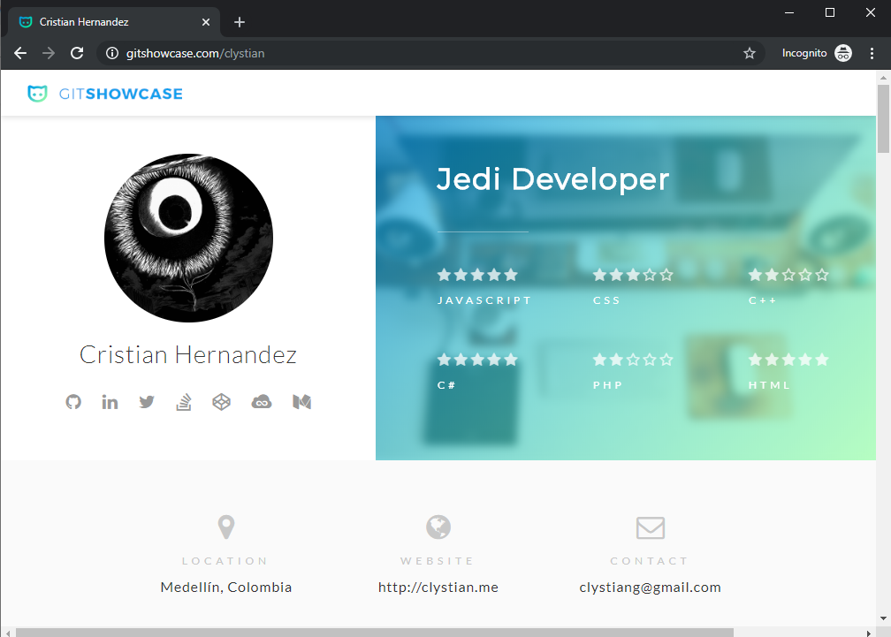

# GitHub Page clystian.github.io 

### Top Languages - GitHub


[](https://github.com/anuraghazra/github-readme-stats)

## links

https://clystian.github.io or https://clystian.ninja

# Page Preview 2020-01-04



# Screenshot from gitshowcases



This is a modern portfolio site built with [Astro](https://astro.build/) and [Tailwind CSS](https://tailwindcss.com/), deployed via GitHub Pages.

## Manfred Profile

The site content is sourced from `manfred.json`, which follows the [Manfred MAC schema](https://github.com/getmanfred/mac). Update this file to change your personal data and experiences. After editing, rebuild the site.


## Development

```bash
npm install
npm run dev
```

## Testing

Run the automated test suite to ensure the site builds and the homepage loads:

```bash
npm test
```

## Build for Production

```bash
npm run build
```

## Deploy to GitHub Pages
- Custom domains can use a `CNAME` file in `public/`; this file is optional and not included by default.
- Push the `dist/` folder to the `gh-pages` branch or configure your repository for GitHub Pages deployment.

## License

MIT
